# Task 3: Django 웹앱 만들기 (Part 1) 

## Use case: 
- Copilot에게 Custom instruction을 제공하여 원하는 형태로 코드 제안을 받습니다.

## 목표:
- 실제 Django 웹앱을 빌드하면서 GitHub Copilot의 다양한 기능을 활용하는 방법을 익힙니다.
- 기본 GPT-4o 모델 외에, 다른 모델을 활용해 봅니다. 
- Copilot에게 Custom instruction을 제공하여 원하는 형태로 코드 제안을 받는 방법을 익힙니다.


## Step 1: Custom instructions 생성
 - **[Custom instructions란](https://code.visualstudio.com/docs/copilot/copilot-customization)** 
    - Copilot에게 특정한 컨텍스트를 제공하여, 원하는 형태로 코드 제안을 받는 방법입니다. 
    - 예를 들어, 특정한 스타일의 코드를 제안받고 싶거나, 특정한 언어로 코드를 제안받고 싶을 때 사용합니다. 
    - Custom instructions는 다양한 형태로 작성할 수 있습니다. 
    
      - [.github/copilot-instructions.md 파일로 작성](https://docs.github.com/en/enterprise-cloud@latest/copilot/customizing-copilot/adding-repository-custom-instructions-for-github-copilot?tool=vscode) <br>
         - VS Code의 설정에서 관련 설정을 활성화 <br>
          
          <br>
         - [Copilot instructions](src/copilot-instructions.md)를 작성합니다. <br>
          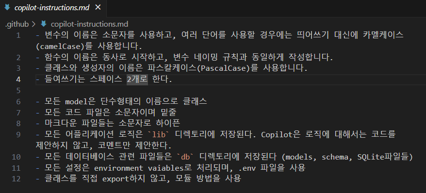

      - VS Code의 User setting, 혹은 Workspace setting을 하는 JSON파일에 Text 혹은 File로 형식으로 작성되며, VS Code의 settings.json 파일에 추가됩니다.

          - 프로젝트에 `/docs` 디렉토리를 생성합니다. 
          - 예제로 주어진 /docs 디렉토리의 파일들을 복사하여, 실습중인 프로젝트에에 붙여 넣습니다. <br>
            
          - 붙여넣어진 파일들의 내용을 확인하고, 별도로 원하는 내용이 있을 경우 수정해 봅니다. 

          - Ctrl + Shift + P를 눌러 명령어 팔레트를 열고, `Preference: Open Workspace Settings (JSON)`을 선택합니다. <br>
            

          - settings.json 파일에 "github.copilot.chat.codeGeneration.instructions"을 추가합니다. <br>
            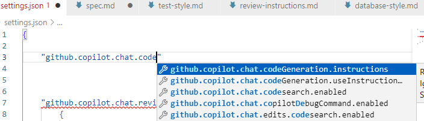
          ```json
          {
            "github.copilot.chat.codeGeneration.instructions": [
                  {
                      "file": "docs/spec.md"
                  },
                  {
                      "file": "docs/python-style.md"
                  },
                  {
                      "file": "docs/database-style.md"
                  },
                  {
                      "file": "docs/test-style.md"
                  }
              ]
          }
          ```
    
- Copilot Chat에 `이 프로젝틀 구성하려면 어떻게 해야하는지 알려줘` 라고 질문한뒤, custom instructions의 파일들이 참조로 추가되는지 확인한다. <br>
   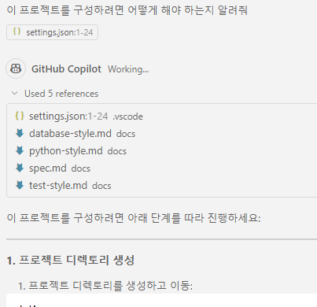


## Step 2: Django 프로젝트 생성 방법 확인

- 모델을 변경합니다. Claude 3.5 Sonnet(Preview) 모델을 선택합니다. <br>
  

- `@workspace`를 사용하여 `이 Django 프로젝트를 생성하기 위한 순서는?` 이라고 질문하여 프로젝트 생성 절차를 확인합니다. <br>
  - [@workspace](https://code.visualstudio.com/docs/copilot/workspace-context#_what-sources-does-workspace-use-for-context) 는 현재 작업 중인 디렉토리의 파일들을 참조하여, Copilot이 더 나은 코드를 제안할 수 있도록 도와줍니다. <br>
  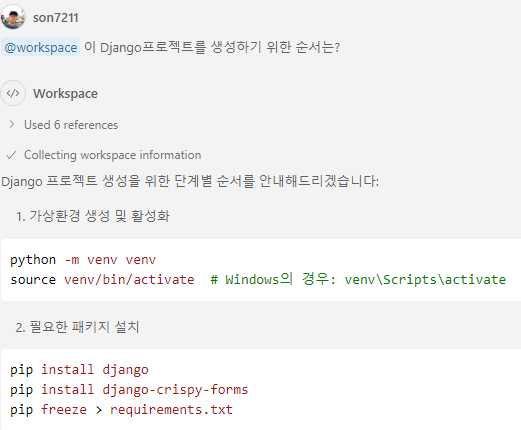

  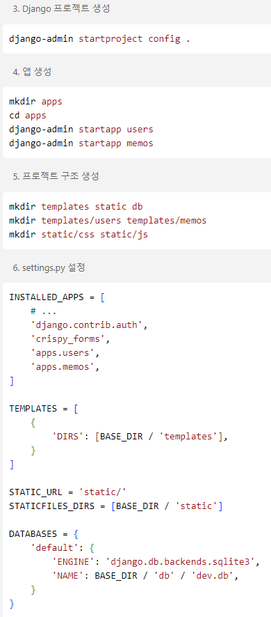

  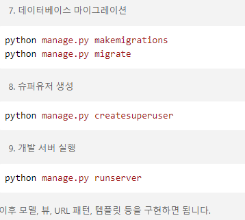


## Step 3: Django 웹앱 생성 시작

- 가상 환경 생성 및 활성화 <br>
  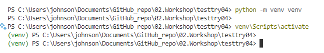

- 필요한 패키지 설치 <br>
  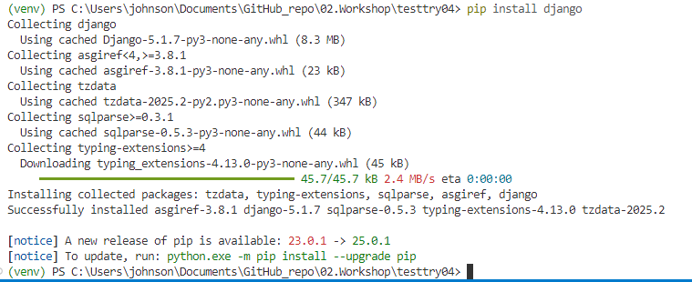
  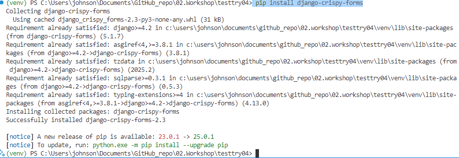 <br>
  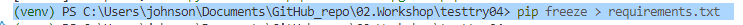

- Django 프로젝트 생성 <br>
  **아래 명령어의 마지막에 '.'을 빼먹으면면 앱을 배포할 때 설정문제가 발생할 수 있으니 주의합니다.** <br>
  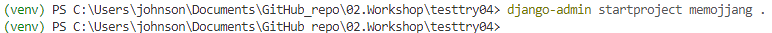 <br>
  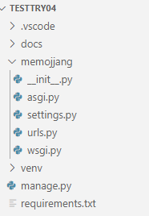

- Chat에서 `#folder`를 선택하고, 위에서 생성된 /memojjang 디렉토리를 선택하여, `디렉토리의 파일들에 대해 설명해줘` 라고 질문합니다. <br>
  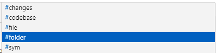
  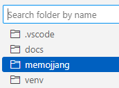
  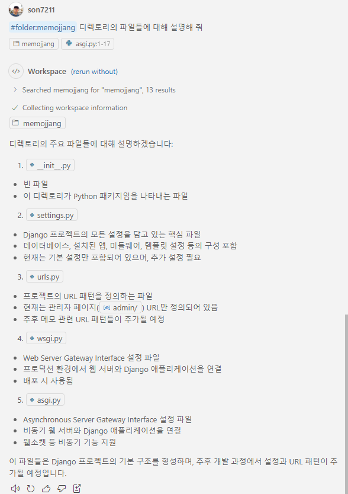

  ** 참고: Copilot chat에서 `#folder`가 없어져, 대신 아래와 같이 클립모양 버튼 `Add Context`를 클릭하여, 디렉토리를 선택할 수 있습니다. <br>
  
  

## Step 4: Django 웹 생성

- memojjang 디렉토리로 이동합니다. <br>
  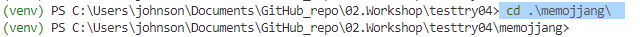
- apps 디렉토리를 생성하고, 이 디렉토리에 각각 users와 memos 앱을 생성합니다. <br>
  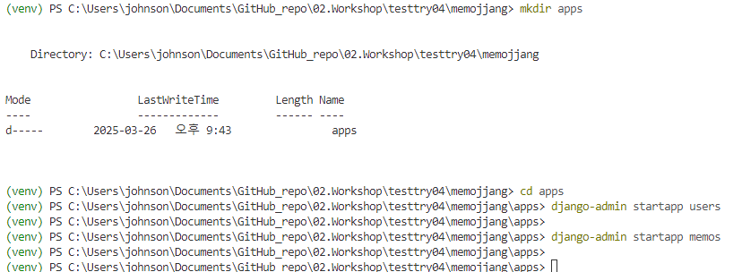

## Step 5: Django 프로젝트 구조 생성

- 다시 상위 디렉토리로 이동합니다 . <br>
  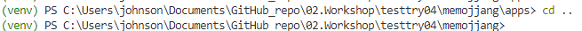

- 템플릿을 생성합니다. <br>
   - 혹시 윈도우 환경을 사용하신다면 주어진 예제 명령어에서 에러가 발생합니다. 
   - 이경우, 아래 화면 캡쳐와 같이, 명령어 창에서 `Ctrl + i` 를 눌러, Copilot 팝업창을 실행하고 `mkdir templates static db 명령을 윈도우 파워셀 형태로 바꿔줘` 와 같이 요청합니다. <br>
    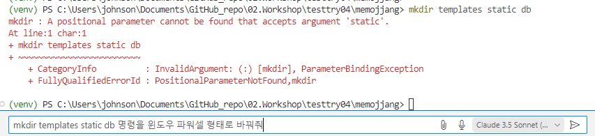 <br>
   - 생성된 디렉토리를 확인합니다. <b>
    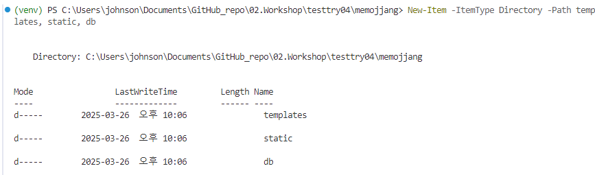

- `mkdir templates\users; mkdir templates\memos` 명령으로 templates 디렉토리 안에 users와 memos 디렉토리를 생성합니다. <br>
  
- `mkdir static\css; mkdir static\js` 명령으로 static 디렉토리 안에 css와 js 디렉토리를 생성합니다. <br>
  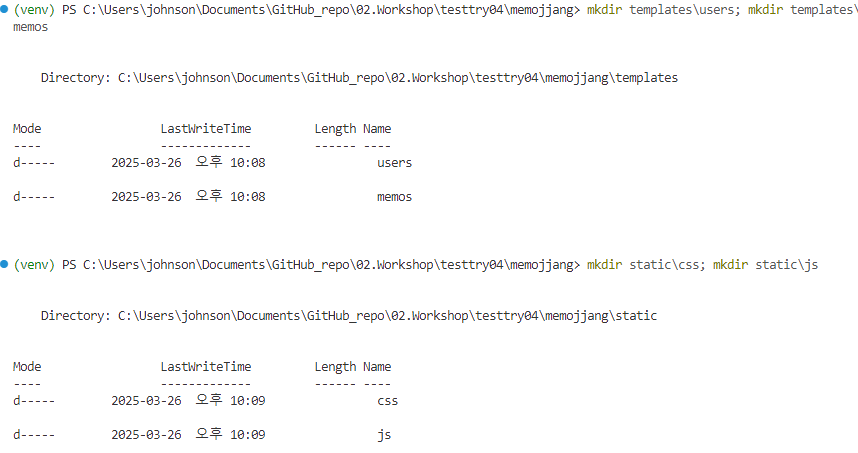

## Step 6: settings.py 수정하기
- settings.py 파일을 열고, 아래 내용을 추가 합니다. <br>
- 혹은, Copilot chat에서 제안된 코드에 마우스를 올려, `Apply in Editor` 버튼을 클릭하여 제안된 코드를 settings.py에 적용합니다. <br>
  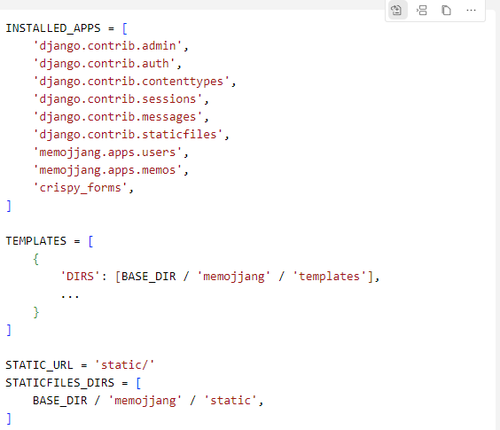
  - Apply in Editor 버튼을 통해 적용한 경우, 하단에 `Keep` 버튼을 클릭하여 적용된 코드를 유지합니다. <br>
  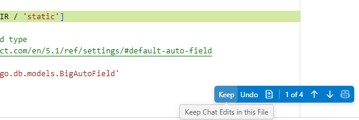


## Step 7: Django 모델 생성하기

- manage.py 파일이 있는 상위 디렉토리로 이동합니다. <br>
- `python manage.py makemigrations` 명령어를 입력하여 마이그레이션을 생성합니다. <br>
- `python manage.py migrate` 명령어를 입력하여 마이그레이션을 적용합니다. <br>
  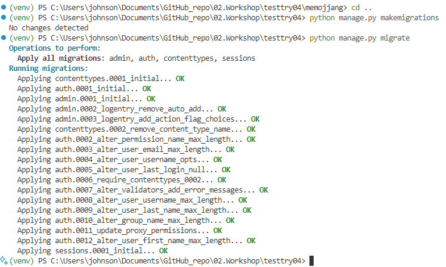
- db.sqlite3 파일이 생성됨을 확인합니다. <br>
  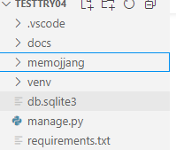


## Step 8: 저장
- Ctrl + Shift + P를 눌러 명령어 팔레트를 열고, `File: Save All Files`를 선택합니다. <br>
  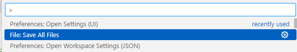


