# Task 4: Django 웹앱 만들기 (Part 2) 

### Use case: 
- Part 1에서 생성된 Django 웹앱에 Copilot을 활용해 모델을 생성하고, Copilot Edit기능을 사용해 템플릿 뷰에 내용을 신속하게 추가하면서 나머지 기능을 구현하며, 추가적인 컨텍스트를 제공하거나, CLI에서의 Copilot을 활용하는 등등 다양한 기능을 활용합니다.

### 목표: 
- 에러 해결을 위해 Copilot에게 다양한 컨텍스트 추가 방법을 익힙니다. #terminalSelection, #file, #selection

- CLI 명령어 창에서 Copilot을 활용하는 방법을 익힙니다.
- Copilot Edit을 활용해 여러개 템플릿 파일을 동시에 생성하는 방법을 실습합니다.
- prompt 파일을 생성하여, Copilot Edit을 활용해 여러개 템플릿 파일을 동시에 생성하는 방법을 실습합니다. 

### Step 1: User 모델 생성

- `python manage.py runserver` 명령을 통해 개발 서버를 실행 합니다.  
  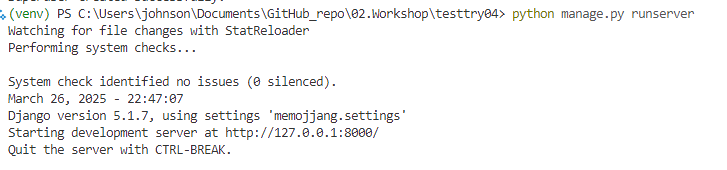 
  - 만약 아래와 같이 에러가 발생하면, `#terminalLastCommand`를 통해 에러 수정을 요청합니다.   
    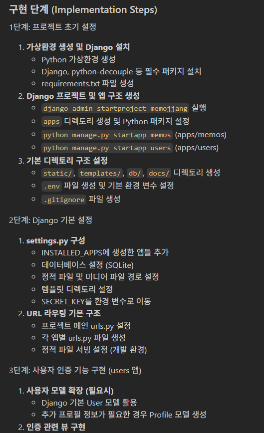
    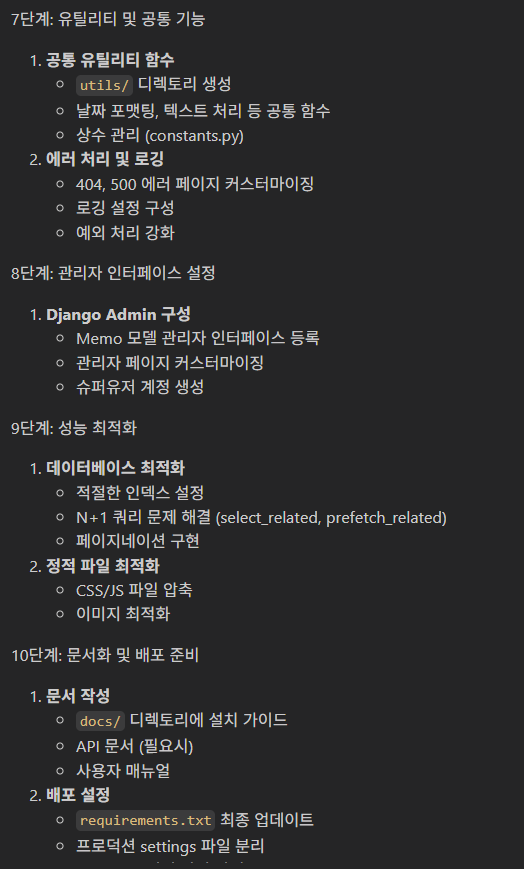
    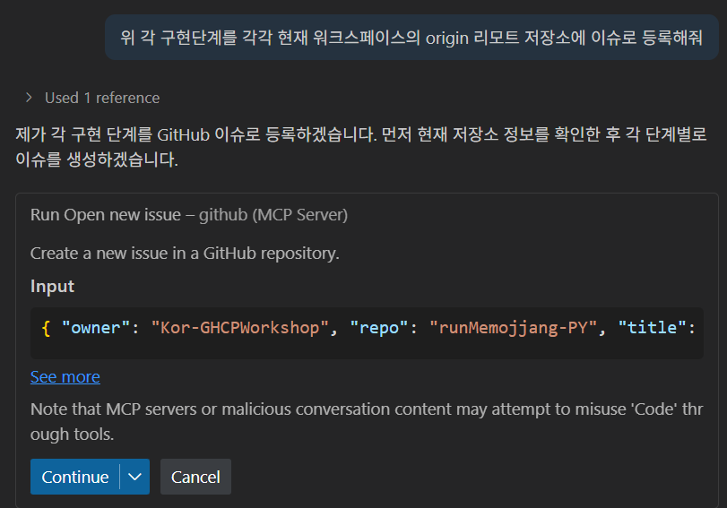

- `users/models.py` 파일을 열고, Copilot chat에 요청하여 모델을 정의 합니다.  
    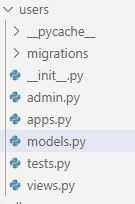
    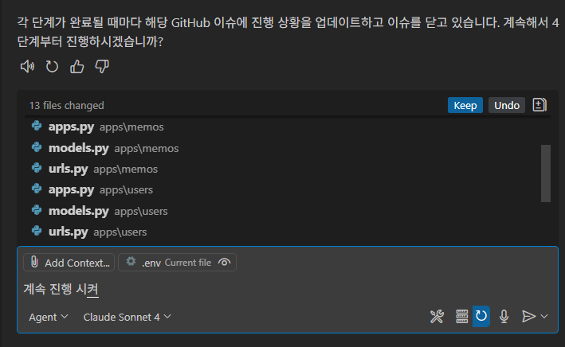

   * 혹, 불필요한 부분이 제안되었다면 삭제합니다. (닉네임, 이미지등)

- `settings.py` 파일에 다음을 추가합니다. 
    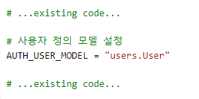

- 모델 정의 후, Copilot이 제안해 준, 이어지는 과정을 진행하기 위해 별도 CLI터미널을 실행합니다.  
    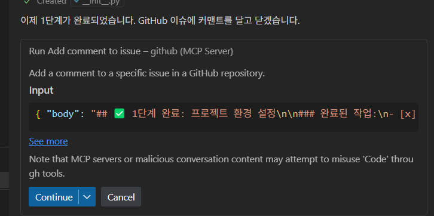
    

- venv를 실행합니다.  
    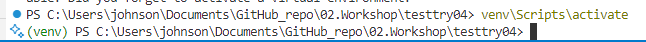

- `python manage.py makemigrations users` 명령어를 실행합니다.  
    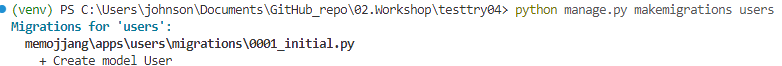

- `python manage.py migrate` 명령어를 실행합니다.  
    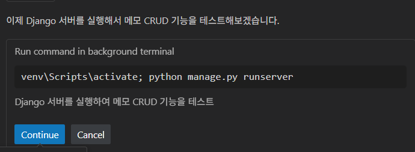

  * Copilot이 제안해준 명령어에 마우스를 위치하면, `'Insert into terminal`'을 통해 실행할 수도 있습니다.  
    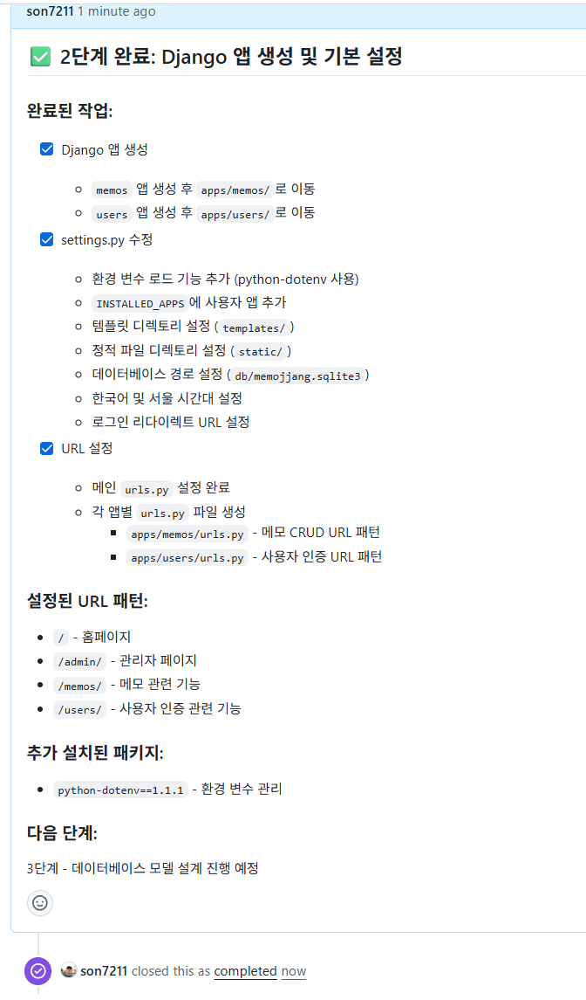

- Admin페이지에 모델을 등록하기 위해 `admin.py` 파일을 열고, 모델을 등록합니다.  
    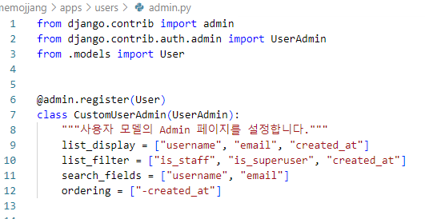

### Step 2: 슈퍼 유저 생성하기
- CLI 터미널에서 Ctrl + i를 입력하고, Copilot 창에에 `superuser를 생성` 라고 입력합니다. 
  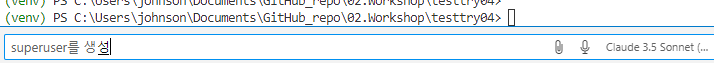
  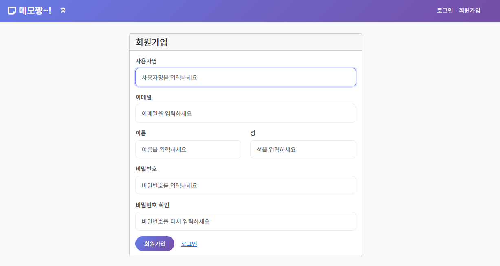
   - `Insert into terminal` 혹은 `copy` 버튼을 활용합니다. 

- `python manage.py createsuperuser` 명령어를 통해해 슈퍼 유저를 생성합니다.  
  

### Step 3: Memos 모델 생성
- 개발 서버는 계속 실행 중인 상태에서 진행합니다.  

- `memos/models.py` 파일을 열고, Copilot chat에 요청하여 모델을 정의 합니다.  
    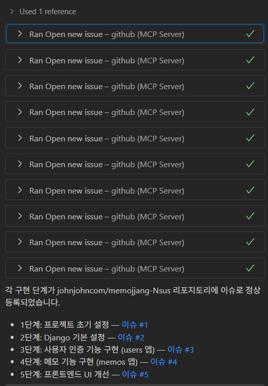
    
    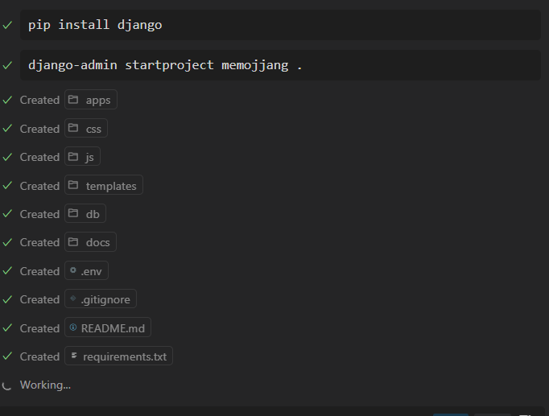

- `python manage.py makemigrations` 명령어를 실행합니다.  
    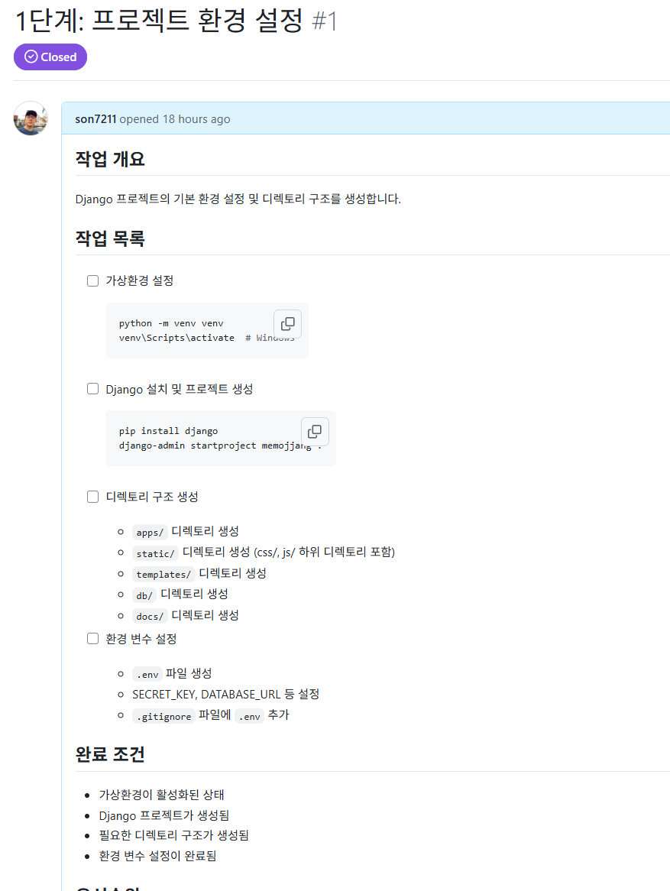
    
- `python manage.py migrate` 명령어를 실행합니다.  
    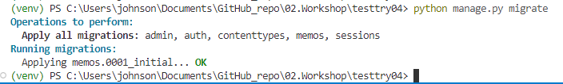

- 관리자 페이지에 모델을 등록하기 위해 `memos`디렉토리의 `admin.py` 파일을 열고, 모델을 등록합니다.  
  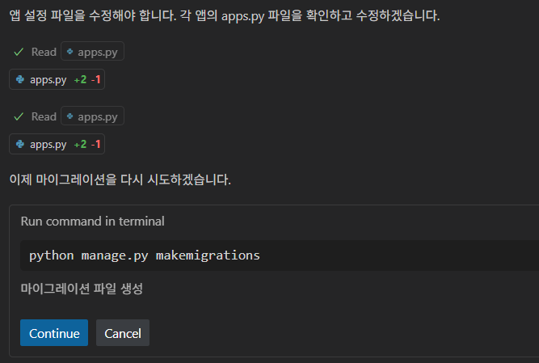

- localhost:8000/admin/으로 접속하여, 관리자 계정으로 로그인합니다.  
    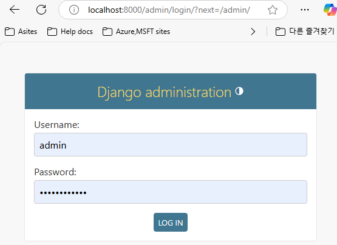

- 등록된 모델을 확인합니다.  
    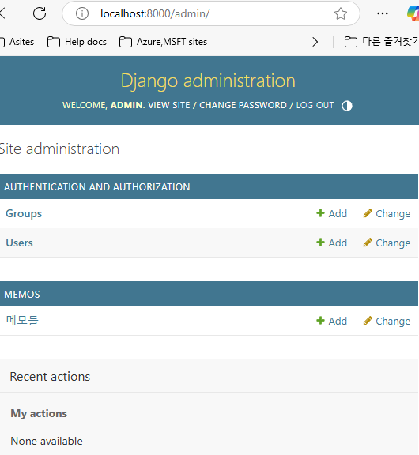

- Ctrl + Shift + P를 눌러 명령어 팔레트를 열고, `File: Save All Files`를 선택합니다.  

### Step 4 : 이후 과정 질문하기

- `@workspace`를 활용해, Copilot에게 이후 프로젝트를 완성하기 위해 어떤 과정이 남았는지 확인합니다.  
    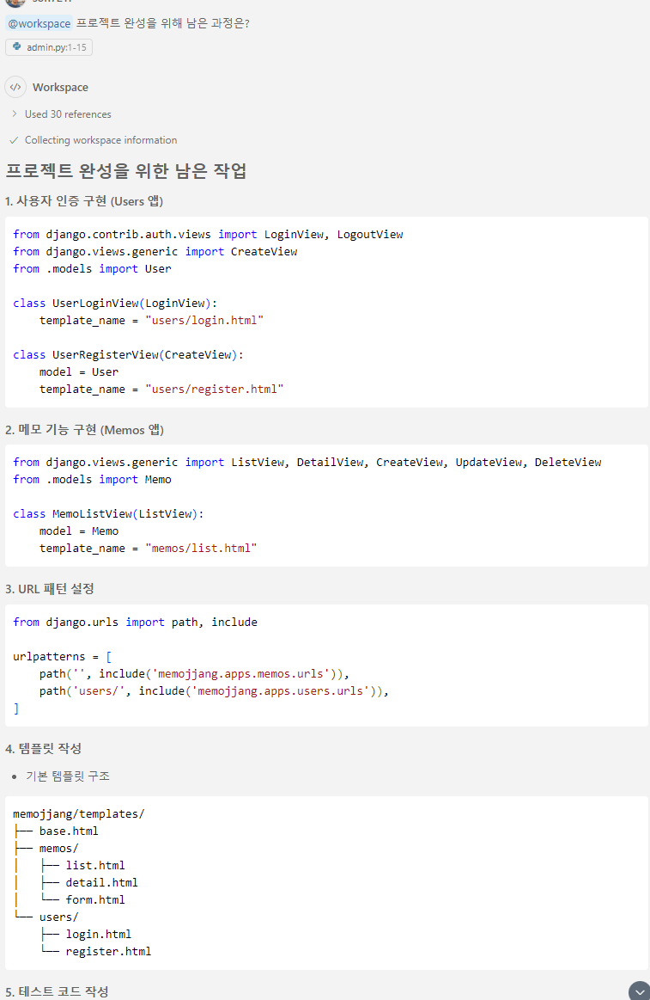
    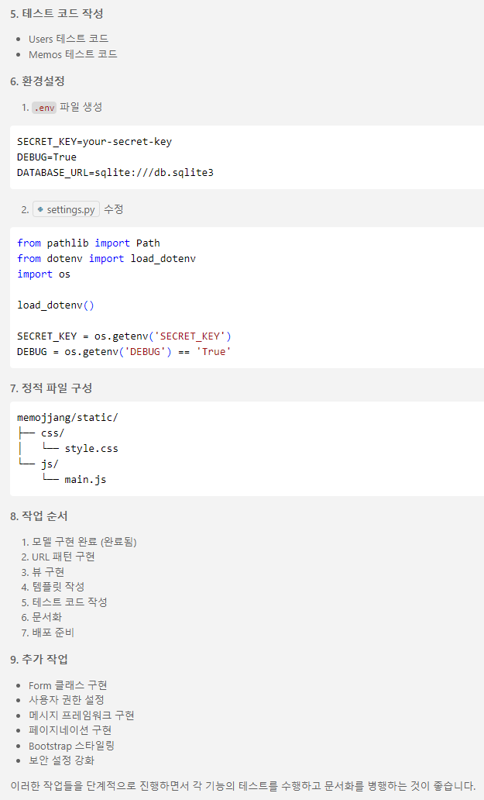

### Step 5: Prompt파일 생성 - Copilot Edit을 통해 뷰, 템플릿, URL동시에 생성하기

- **[Prompt 파일 이란?](https://code.visualstudio.com/docs/copilot/copilot-customization#_reusable-prompt-files-experimental)**
  - Prompt 파일은 재사용 가능한 프롬프트 지시문을 Markdown 형식으로 저장해, Copilot에 손쉽게 추가 맥락을 제공할 수 있도록 도와줍니다. 예컨대 특정 아키텍처 요건, 코드 스타일 등을 이 파일에 정리해두면, 반복적인 지시사항 없이도 채팅 창에서 손쉽게 불러와 의도된 코드를 빠르게 생성할 수 있습니다.
  - Use cases:
    - 코드 생성(Code generation): 컴포넌트, 테스트, 마이그레이션 등을 재사용 가능한 프롬프트로 만들어, 예를 들어 React 폼이나 API 목업을 간편히 생성.
    - 도메인 전문 지식(Domain expertise): 보안 정책이나 컴플라이언스 확인처럼 특화된 지식을 프롬프트로 공유.
    - 팀 협업(Team collaboration): 문서나 사양을 참조해 패턴과 가이드라인을 기록.
    - 온보딩(Onboarding): 복잡한 프로세스나 프로젝트별 패턴을 단계별로 안내하는 가이드를 생성.

- 템플릿에 대한 Prompt 파일을 생성합니다.  
  
    

- 