# Task 5: Test코드 작성

## Use case: 
- Copilot Agent 모드를 활용해 Test code를 생성하고 실패된 테스트를 수정합니다.
- Copilot을 활용해 Commit message를 자동 생성합니다.

## 목표:
 - Copilot Agent모드를 활용하여, 여러개의 테스트 파일을 동시에 생성하는 방법을 실습합니다.
 - Commit message 자동 생성 기능을 사용해 보고, Custom instruction을 제공하여, 원하는 형태로 commit message를 제안받아 봅니다.

## Step 1: Copilot Agent모드를 활용하여 테스트 코드 작성
 - Task 3에서 생성한 TestCustom instructions를 확인합니다. (`test-style.md`) <br>
   (원하는 내용이 있을 경우 추가 삭제) <br>
   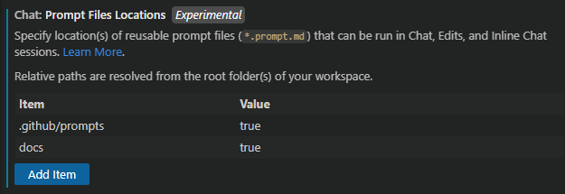

 - Copilot Agent 모드를를 열고, 'Add Files' 버튼에서 프로젝트 디렉토리를 선택한 뒤, 챗 창에 `이 프로젝트의 테스트 코드를 작성하고 테스트 결과를 확인해줘` 등으로 요청합니다. <br>
    <br>
   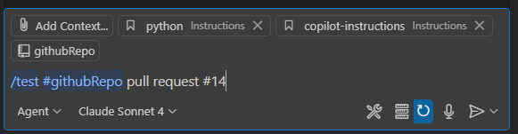

 - Copilot Agent 모드가 테스트 코드들을 생성합니다. <br>
   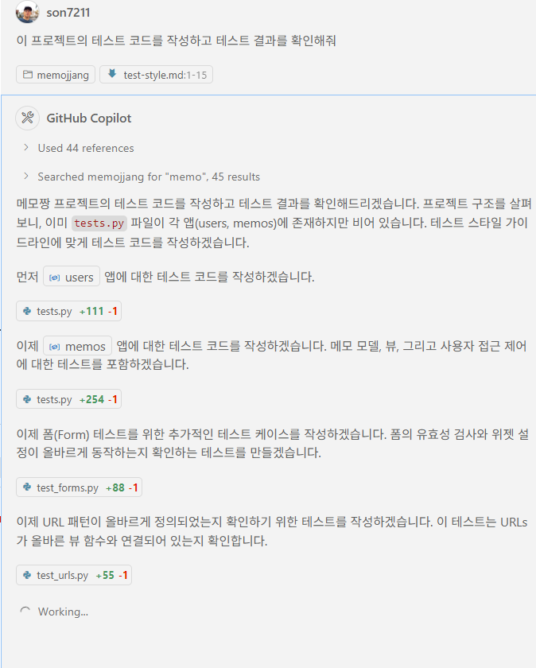 <br>
   - Agent모드가 자동으로 테스트 파일들도 생성하여 추가합니다. <br>
    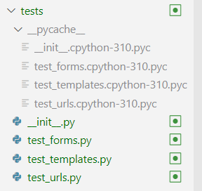 <br>

 - Agent 모드가 생성된 테스트 코드를 실행하여 결과를 확인할 것을 사용자에게 묻습니다. 'Continue' 버튼을 눌러 테스트를 실행합니다.  <br>
 	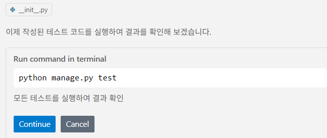 <br>
   - venv를 활성화 하도록 실행할 것을 묻습니다. <br>
    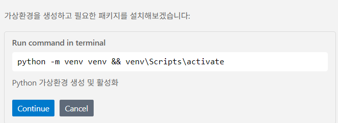 <br>
	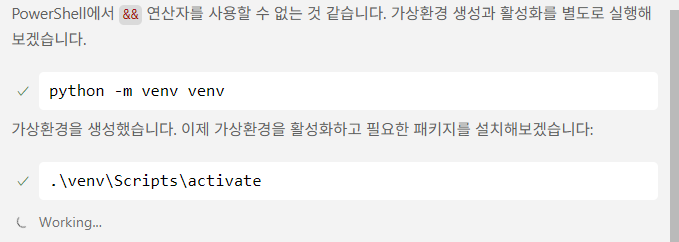 <br>
  
 - 만약 불필요한 패키지등을 설치하려고 하면, Agent모드에 `현재 디렉토리에서 테스트를 실행하고 결과를 확인해 줘 (패키지설치 불필요)` 라고 다시 요청합니니다. <br>
   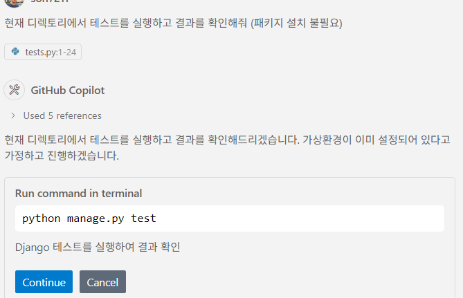 <br>

- Agent모드가 실패한 테스트 내용을 분석하고, 해결 방법을 제안합니다. <br>
    <br>

- 실패한 테스트를 수정하도록 요청합니다. <br> 
   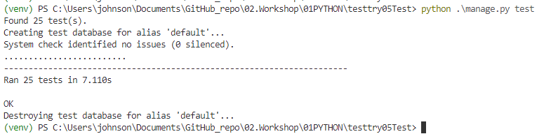 <br>

- Agent모드가 실패한 테스트를 수정하고 다시 실행합니다. <br>
   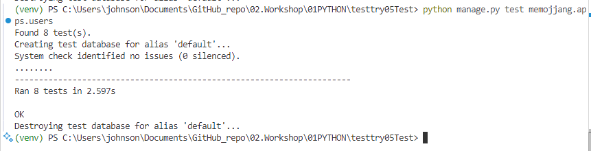 <br>

- 실행 결과, 다른 테스트가 실패한 경우, Agent 모드가 다시 수정합니다. <br>
   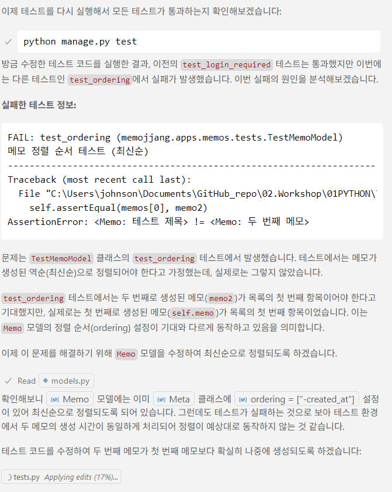 <br>
   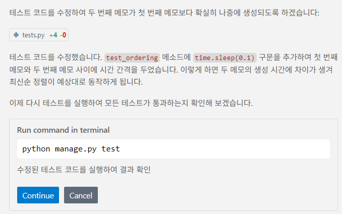 <br>

- 모든 테스트가 성공적으로 완료된 경우, Agent 모드가 성공적으로 완료되었다고 알려줍니다. <br>
   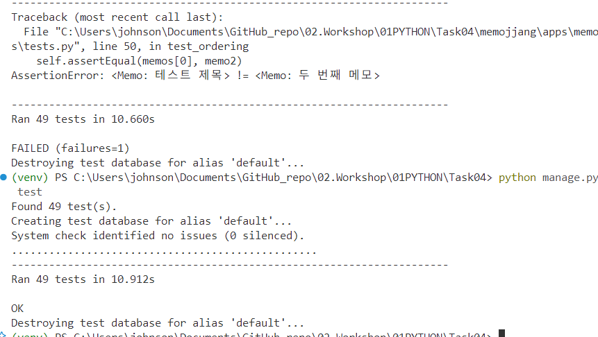 <br>
   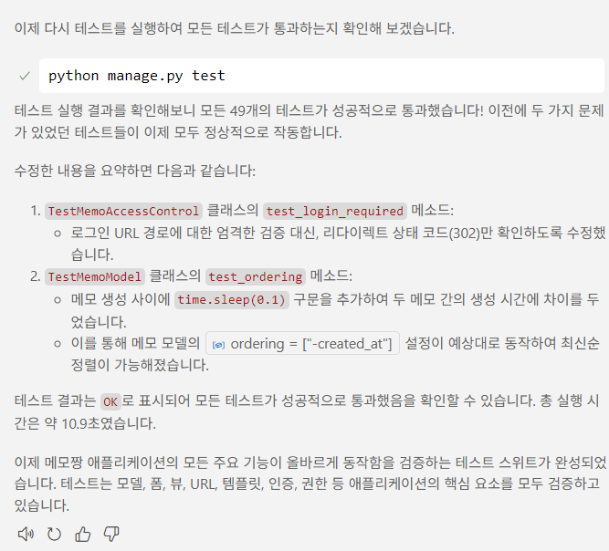 <br>

## Step 2: Commit message 자동 생성 (Custom instruction으로 원하는 형태로 제안받기)
 - .vscode/settings.json 파일을 열고 아래와 같이 입력합니다.  <br>
    ```json
    - "github.copilot.chat.commitMessageGeneration.instructions": [
        {
            "text" : "커밋 메시지는 한글로 작성하며, 현재 시제로 작성합니다. 커밋 메시지는 변경 내용을 자세히 요약해서, 항목마다 문장 앞에 '-'를 붙여서 작성해주세요. 이모지들을 포함합니다."
        }
    ]
    ```
    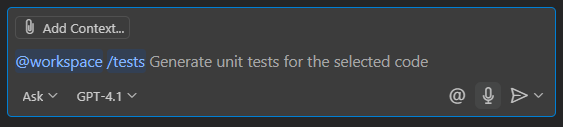

    - 파일 변경내용을 저장합니다. <br>
 
 - 왼편의 Git 아이콘을 클릭하고, 'Changes' 우측의 '+' 아이콘을 클릭하여, 변경된 파일을 staging area에 추가합니다. <br>
   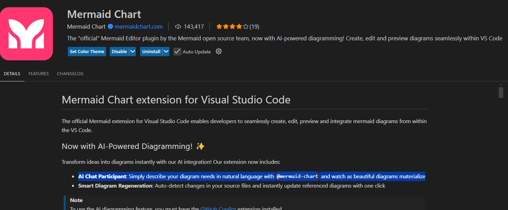 <br>

   ** Git이 초기화되지 않은 경우, 'initialize repository'를 클릭하여 Git을 초기화합니다. <br>
   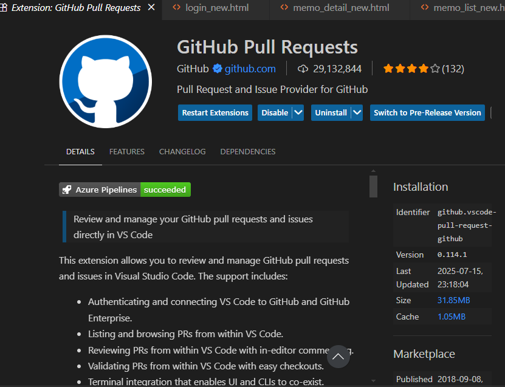 <br>


 - Message 입력란 우측에 'sparkle' 아이콘을 클릭합니다다. <br>
   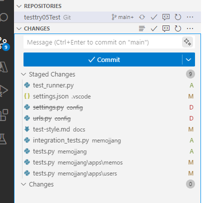 <br>
 
  - 제안되는 commit message 내용들을 확인합니다. <br>
   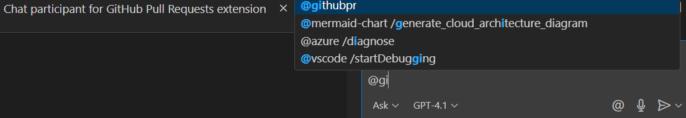

## 추가자료
- [GitHub Copilot을 활용한 Unit test생성 사용예](https://github.blog/ai-and-ml/github-copilot/how-to-generate-unit-tests-with-github-copilot-tips-and-examples/)