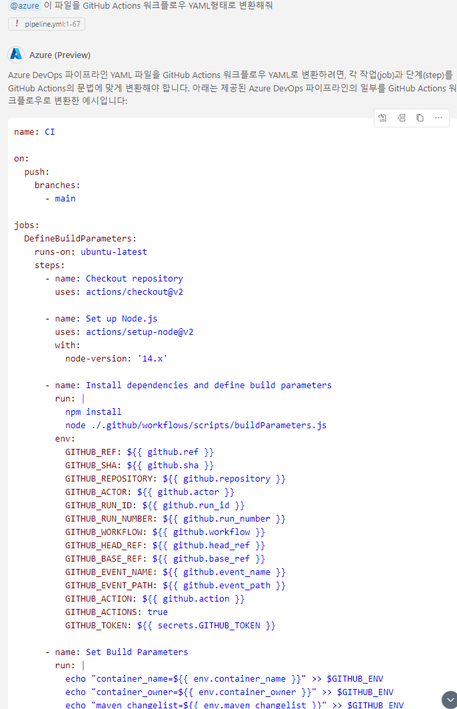

# Task 7: CI/CD 파이프라인 실습

## Use case: 
- GitHub Copilot을 사용해 파이프라인에 대한 설명, 변환등을 실습하는 예제입니다.

## 목표:
- GitHub Copilot을 사용해 파이프라인에 대한 설명과 GitHub Actions로 변환해 봅니다. 
- 원하는 GitHub Actions workflow를 생성해보세요.

## Steps:
- [pipeline.yml](src/pipeline.yml) 파일에 대해 원하는 부분을 GitHub Copilot의 도움을 받아아 GitHub Actions workflow로 변환해보세요.
  - 프롬프트 예시: `이 파일을 GitHub Actions 워크플로우 YAML형태로 변환해줘`  
  

- [action.yml](src/actions.yml) 파일의 내용을 바탕으로 GitHub Actions workflow를 Copilot의 도움으로 생성해보세요.

