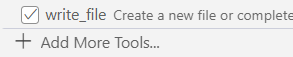
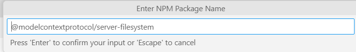
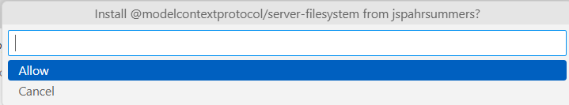
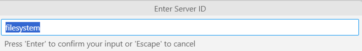
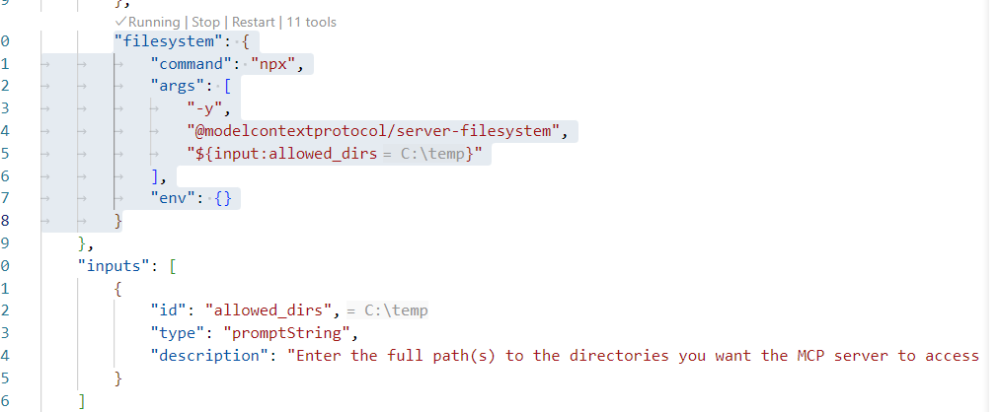
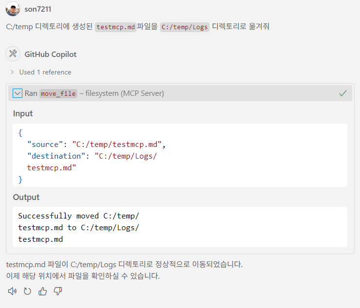
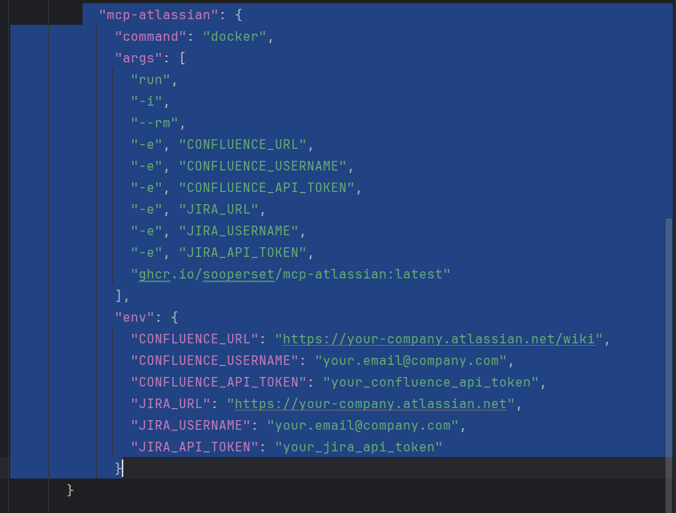

# Task 8: MCP (Model Context Protocol) 활용 실습

## Use case: 
- VS Code에서 Model Context Protocol 서버를 설정하고, 실습하는 예제입니다.

## 목표:
- MCP (Model Context Protocol)의 기능을 이해하고, VS Code에서 MCP 서버를 설정하여 활용하는 방법을 익힙니다.

## Step 1: MCP (Model Context Protocol) 이해하기
### MCP란? 
  - [Model Context Protocol(MCP)](https://modelcontextprotocol.io/introduction)는 AI 모델이 외부 도구, 애플리케이션, 데이터 소스를 탐색하고 상호작용할 수 있도록 표준화된 방법을 제공합니다. VS Code에서 에이전트 모드로 언어 모델에 채팅 프롬프트를 입력하면, 모델은 파일 작업, 데이터베이스 접근, API 호출 등 다양한 도구를 호출하여 요청에 응답할 수 있습니다.
  - [MCP Specification](https://modelcontextprotocol.io/specification/2025-03-26) 

### MCP 구조 : 클라이언트 - 서버 구조
  - MCP clients (like VS Code) connect to MCP servers and request actions on behalf of the AI model
  - MCP servers provide one or more tools that expose specific functionalities through a well-defined interface
  - The Model Context Protocol (MCP) defines the message format for communication between clients and servers, including tool discovery, invocation, and response handling <br>

   <br>
   <br>

### MCP서버의 기능
  - [MCP서버는 아래 3가지 기능을 제공](https://modelcontextprotocol.io/specification/2025-03-26#features)합니다. 
  - Resources: Context and data, for the user or the AI model to use
  - Prompts: Templated messages and workflows for users
  - Tools: Functions for the AI model to execute

### MCP 개발 SDKs
  - [MCP 공식페이지](https://modelcontextprotocol.io/introduction) 에서 다양한 MCP SDK를 확인할 수 있습니다.
  - [python-sdk](https://github.com/modelcontextprotocol/python-sdk)

### MCP 서버의 예시
  - [MCP 서버 예시](https://mcpservers.org/) 
  - [Smithery](https://smithery.ai/)
  - [MCP server repository](https://github.com/modelcontextprotocol/servers) <br>
  - [MCP.so](https://mcp.so/)

  에서 다양한 MCP 서버를 확인할 수 있습니다.


## Step 2: VS Code에서 테스트 MCP 서버 설정 (npm 패키지 설치)

- [VS Code에서 MCP 서버설정: GitHub도움말](https://docs.github.com/en/enterprise-cloud@latest/copilot/customizing-copilot/extending-copilot-chat-with-mcp?tool=vscode)을 참고하여, MCP 서버를 설정합니다. <br>

- 먼저, VS Code Agent 모드의 공구 모양 아이콘을 클릭하고, '`Add More Tools`'를 선택합니다. <br>
   <br>
   <br>

- `Add MCP server`를 선택합니다. <br>
   <br>

- NPM Package를 선택하고 `@modelcontextprotocol/server-filesystem` 를 입력합니다. <br>
   <br>

- Allow를 선택하고, 비어있는 Temp 디렉토리를 생성하고 패스를 입력합니다. <br>
   <br>
   <br>

- Server ID에서는 그냥 Enter를 눌러 기본값을 사용합니다. <br>
   <br>

- `User settings` 혹은 `Workspace settings`을 선택합니다. 여기서는 `Workspace settings`을 선택합니다. <br>
   <br>

- mcp.json 파일에 추가된 MCP 서버 설정을 확인합니다. <br>
   <br>

- 다시 Agent 모드의 공구 모양 아이콘을 클릭하고, 추가된 Tool을 확인합니다. <br>
   <br>


## Step 3: MCP 서버 테스트

- 'filesystem'을을 테스트 하기 위해 Agent 모드에서 아래와 같이 실행해 봅니다. <br>
  - `C:/temp 디렉토리에 testmcp.md라는 이름으로 새로운 파일을 생성해줘`
  - `C:/temp 디렉토리에 생성된 testmcp.md파일을 C:/temp/Logs 디렉토리로 옮겨줘` --> MCP tool이 실행됩니다. <br>
   <br>
   <br>

## Step 4: Stdio MCP 서버 설정
- https://github.com/modelcontextprotocol/python-sdk 의 파이썬 예제를 구성하고 stdio MCP 서버를 설정해 봅니다. 
- uv 매니져 설치
  - https://docs.astral.sh/uv/#installation

- VS Code를 새로 시작하여 새로운 워크 스페이스를 생성합니다. 
- uv 프로젝트 시작
  - `uv init mcp-server-demo`
  - `cd mcp-server-demo` 로 이동
- MCP 서버 설치
  - `uv add "mcp[cli]"`

- server.py 파일을 생성하고 아래와 같이 작성합니다. 
	```python
	# server.py
	from mcp.server.fastmcp import FastMCP

	# Create an MCP server
	mcp = FastMCP("Demo")


	# Add an addition tool
	@mcp.tool()
	def add(a: int, b: int) -> int:
		"""Add two numbers"""
		return a + b

	if __name__ == "__main__":
		mcp.run()
	```

- 위 Step 2에서 MCP 서버를 설정한 것과 같이 생성하되, 이번에는 `Command(stdio)` 형태로 설정합니다. 
  - command는 `uv`로 설정하고, args는 `run server.py`로 설정합니다.
	```json
	
		"mcp-stdio-python": {
			"type": "stdio",
            "command": "uv",
            "args": [
                "run",
                "C:\패스\server.py"
            ]
        }
	```
  - 추가된 서버가 실행되고 있지 않다면, mcp.json 설정 파일의 해당 MCP서버 위에 표시되어 있는 'start' 버튼을 클릭합니다. 
   <br>

- Agent모드의 MCP Tool에 도구가 추가된 것을 확인합니다. 

## Step 5: Docker 형태의 MCP 서버 설정 (GitHub MCP server)
 - https://github.com/github/github-mcp-server 저장소의 GitHub MCP 서버를 Docker 형태로 설정합니다.
 - 이 MCP 서버는 사용자 랩탑에 Docker 엔진이 실행되고 있어야 합니다. (docker desktop 설치 필요)
 - 저장소 Readme 파일의 Installation 부분에 있는 설정 방법을 `mcp.json` 파일에 추가하여 tool이 추가되는 것을 확인합니다. 
   ```json
	"inputs": [
			{
			"type": "promptString",
			"id": "github_token",
			"description": "GitHub Personal Access Token",
			"password": true
			}
		],
		"servers": {
			"github": {
				"command": "docker",
				"args": [
				"run",
				"-i",
				"--rm",
				"-e",
				"GITHUB_PERSONAL_ACCESS_TOKEN",
				"ghcr.io/github/github-mcp-server"
				],
				"env": {
				"GITHUB_PERSONAL_ACCESS_TOKEN": "${input:github_token}"
				}
			}
		}

	```
 - 'start' 버튼을 클릭하여 MCP 서버를 시작합니다.


## Step 6: Atlassian MCP 서버와 연결하기
- Atlassian MCP 서버를 설정하여, Jira와 Confluence와 같은 Atlassian 제품과 통합할 수 있습니다.
- Atlassian에서 제공하는 MCP서버는 Remote MCP 서버로 설정할 수 있습니다.(https://www.atlassian.com/platform/remote-mcp-server)
- 로컬에서 도커로 실행가능한, https://github.com/sooperset/mcp-atlassian 의 MCP서버를 설정할 수 있습니다. 
  - 위 저장소의 README 파일을 참고하여, MCP 서버를 설정합니다.
  - Authentication Setup : B. Personal Access Token (Server/Data Center)
  - Installation : docker 설치 <br>

  ```json
  "mcp-atlassian": {
      "command": "docker",
      "args": [
        "run",
        "-i",
        "--rm",
        "-e", "CONFLUENCE_URL",
        "-e", "CONFLUENCE_USERNAME",
        "-e", "CONFLUENCE_API_TOKEN",
        "-e", "JIRA_URL",
        "-e", "JIRA_USERNAME",
        "-e", "JIRA_API_TOKEN",
        "ghcr.io/sooperset/mcp-atlassian:latest"
      ],
      "env": {
        "CONFLUENCE_URL": "https://your-company.atlassian.net/wiki",
        "CONFLUENCE_USERNAME": "your.email@company.com",
        "CONFLUENCE_API_TOKEN": "your_confluence_api_token",
        "JIRA_URL": "https://your-company.atlassian.net",
        "JIRA_USERNAME": "your.email@company.com",
        "JIRA_API_TOKEN": "your_jira_api_token"
      }
    }
  ```
<br>
 <br>
 <br>

  - 사용가능한 Tool 확인
    - `confluence_search`: Search Confluence content using CQL
	- `confluence_get_page`: Get content of a specific page
	- `confluence_create_page`: Create a new page
	- `confluence_update_page`: Update an existing page

## 지식 확인
- MCP의 구조와 기능, 연결 방법은 어떤 것들이 있습니까?
- MCP 서버의 예제들은 어떤 것들이 있습니까?
