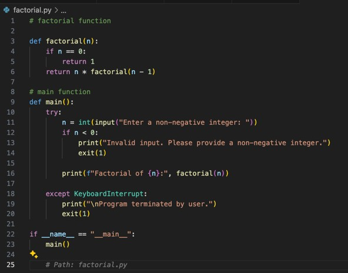
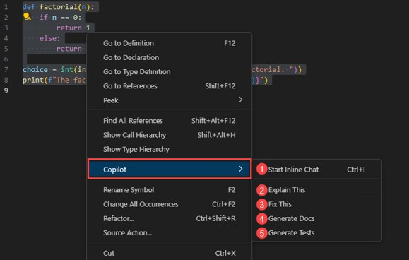

# Project 1: 간단한 함수 및 테스트 코드 제안 받기

### Use case: 
- GitHub Copilot를 활용하여 간단한 함수와 테스트 코드를 제안받습니다. 이를 통해, GitHub Copilot이 기본적인 기능을 익히고, 어떠한 방식으로 일반적인 코딩 작업을 지원하는지 확인할 수 있습니다.

### 목표:
- Python/JavaScript/Java 등의 언어를 활용하여, 간단한 함수 (factorial, is_prime)를 작성합니다.
- 작성한 함수에 대한 테스트 코드를 작성합니다.

### Steps:
- 주석을 활용하여, 원하는 함수를 주석으로 작성합니다.
- 마우스 오른 버튼을 클릭하여, 'Copilot' 메뉴의 'generate_test'를 선택합니다.
- 혹은 Copilot Chat을 이용하여 unit test 코드를 요청합니다.

### HINT:

