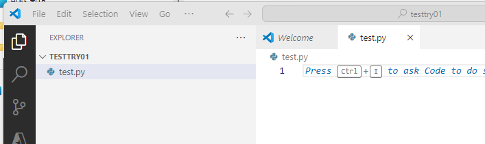
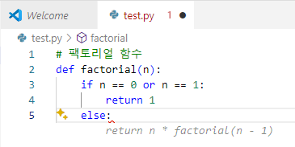
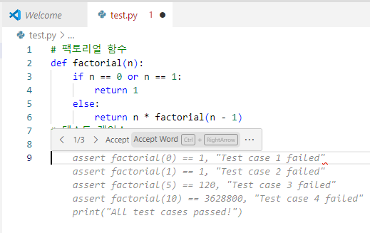
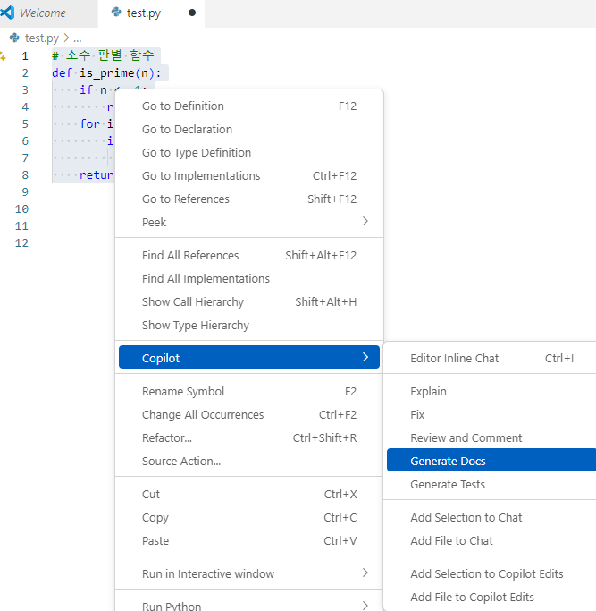
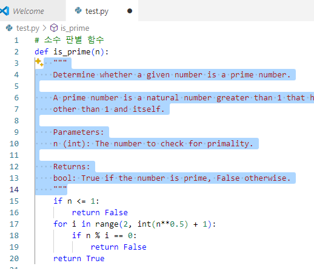
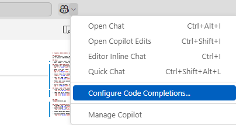

# Project 1: 간단한 함수 및 테스트 코드 제안 받기

### Use case: 
- GitHub Copilot를 활용하여 간단한 함수와 테스트 코드를 제안받습니다. 이를 통해, GitHub Copilot이 기본적인 기능을 익히고, 어떠한 방식으로 일반적인 코딩 작업을 지원하는지 확인할 수 있습니다.

### 목표:
- 주석을 활용하여, 간단한 함수 (factorial, is_prime)를 코드완성 기능으로 작성합니다. 
- 작성한 함수에 대한 테스트 코드를 작성합니다.

### Step1 : 기본 함수 작성성
- VS Code를 열고, 새로운 파일을 생성합니다. (factorial.py)
  

- 아래의 주석을 입력 합니다.
  `# 팩토리얼 함수 `
  

- 회색으로 제안된 코드를 확인하고, Tab키를 눌러서 코드를 완성합니다. 
   

- 제안된 코드 위에 마우스를 올려 가능한 옵션을 확인합니다. 
    

- 두번째로 아래 주석을 입력합니다.
  `# 소수 판별 함수`

- 회색으로 제안된 상태에서, (코드를 수락하지 않은 상태에서) Ctrl + Enter를 눌러서 제안되는 리스트를 확인합니다.
  

### Step2 : 오른 마우스 Copilot 메뉴 사용하기
- 마우스 오른 버튼을 클릭하여, 'Copilot' 메뉴의 'generate_test'를 선택합니다.
    

- 마우스 오른 버튼을 클릭하여 'Copilot' 메뉴의 'generate_docs'를 선택합니다.
     
    

### HINT:

### Step3 : VS Code의 Copilot 설정 메뉴
- VS Code에서 Ctrl + Shift + P를 누르고, 'preference'을 검색하여, Preference: Open Settings (UI)를 선택합니다.
    
- Copilot locale을 검색하고, 'ko'로 변경합니다. 
    

- Code완성 기능의 기본 모델을 변경해 봅니다. 
  - 상단의 Copilot 아이콘을 클릭하고, 'Configure Code completion'을 선택합니다.
    
  - 'Change completion model'을 선택합니다.
    
  - 모델을 변경합니다. 
    

- Experimental 기능인 'NES(Next Edit Suggestion)'을 활성화/비활성화 해봅니다.
    
    