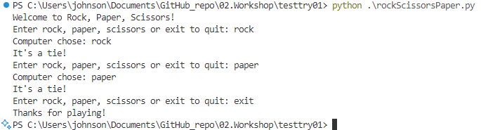
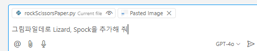
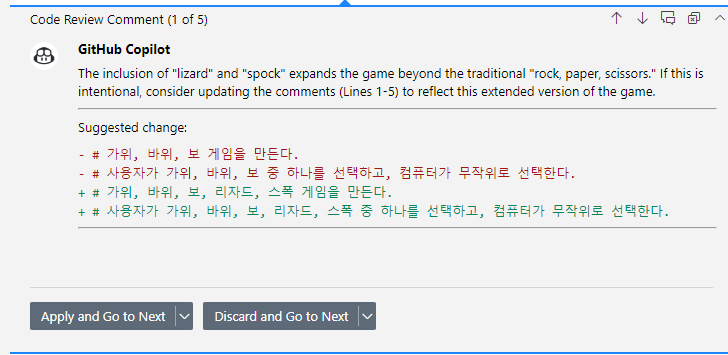

# Task 2: 가위, 바위, 보 게임 만들기 (Copilot Chat사용)

### Use case: 
- GitHub Copilot를 활용하여 가위, 바위, 보 게임을 만들고, 기본 게임에 추가적인 게임 로직을 추가하는 실습을 통해, Copilot의 활용도를 높입니다.

### 목표:
- Python/JavaScript/Java 등의 언어를 활용하여, 가위, 바위, 보 게임을 만듭니다.
- 게임을 실행하고 게임 결과를 출력합니다.
- 기본적인 가위, 바위, 보 게임 외에, Lizard, Spock 등의 확장판 게임을 추가합니다.
- Copilot Chat의 `Vision` 기능을 활용하여, 그림파일을 붙여넣기 하고, 이를 기반으로 코드를 제안받아 봅니다.
- Copilot Chat의 `Review and Comment` 기능을 활용하여, 코드에 대한 리뷰를 받아 봅니다.
- `Review and Comment`에 Custom instruction을 제공하여, 원하는 형태로 리뷰를 받아 봅니다.

### Step1 
- Copilot Chat을 이용하여, 가위, 바위, 보 게임을 만들 수 있는 코드를 요청합니다.
- 사용자가 가위,바위,보 중 하나를 선택하고, 컴퓨터와 대결하는 로직을 추가합니다.
- 사용자가 선택한 가위, 바위, 보와 컴퓨터의 선택을 비교하여 승패를 결정하는 로직을 추가합니다.
- 사용자가 게임을 계속할 것인지 종료할 것인지 선택할 수 있는 로직을 추가합니다. 
    
- 게임을 실행하고, 게임 결과를 출력 받아 봅니다. 
    

### Step 2 : Lizard, Spock 추가하기
- 만들어진 게임에 추가로 Lizard, Spock의 로직을 Copilot을 활용하여 추가합니다. 
 
- `choices` 리스트에 Lizard와 Spock을 추가합니다. 
     

- Copilot Chat에 위 그림파일을 복사하여 Copilot Chat에 붙여넣기 합니다. 
     
     

- Copilot Chat에 붙여넣기 한 그림파일 'Pasted Image'가 있음을 확인합니다. 
     

- Copilot Chat에 "그림파일데로 Lizard, Spock을 추가해 주세요"라고 요청합니다. 
     

- Copilot Chat에서 제안된 코드를 확인합니다. 
     

- Copilot Chat에서 `Apply to file` 버튼을 클릭하여, 제안된 코드를 적용합니다. 
     

- 필요시 미진한 코드를 추가하고 실행해 봅니다. 
     

### Step 3: Review and Comment 사용해 보기기
- 마우스 오른 버튼을 클릭하여, `Review and Comment` 기능을 사용하여, 코드에 대한 리뷰를 받아 봅니다. 
     

     

- 아래 절차데로 `Review and Comment`에 대한 `Custom instructions`을 설정해 봅니다. 
  - Ctrl + Shift + P를 눌러서 명령 팔레트를 엽니다. 
  - `Workspace settings(JSON)`을 선택합니다. 
     

  - JSON 파일에 아래와 옵션을 추가하고 아래 예제와 같이 입력합니다. 
    - `"github.copilot.chat.reviewSelection.instructions"` 
     
    - ` "함수의 이름은 '_'로 시작하고, 변수 네이밍 규칙과 동일하게 작성합니다. 클래스와 생성자의 이름은 파스칼케이스(PascalCase)를 사용합니다. 들여쓰기는 스페이스 2개로 한다."` 

   - 다시 한번 `Review and Comment` 기능을 사용하여, 코드에 대한 리뷰를 받아 봅니다. 
     

### 추가 고려사항:
- 코드 완성 기능과, Copilot Chat 기능의 차이점을 설명합니다.
- 코드 완성 기능과 Copilot Chat 기능에서 LLM으로 전달되는 Context(Prompt)의 차이점은 무엇인가요?