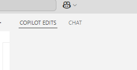

# Task 3: Django 웹앱 만들기 & Copilot에게 Custom instruction 제공하기 (Copilot Edit 사용)

### Use case: 
- Copilot Edit기능을 사용해 를 활용하여 Django 기반의 메모앱을 빌드하면서, Copilot에게 Custom instruction을 제공하여 원하는 형태로 코드 제안을 받습니다.

### 목표:
- 실제 Django 웹앱을 빌드하면서 GitHub Copilot의 다양한 기능을 활용하는 방법을 익힙니다.
- Copilot Edit 기능을 사용해 어떤 기능인지 익힙니다. 
- 기본 GPT-4o 모델 외에, 다른 모델을 활용해 봅니다. 
- Copilot에게 Custom instruction을 제공하여 원하는 형태로 코드 제안을 받는 방법을 익힙니다.

### Steps1: Custom instructions 생성
- 프로젝트에 `/docs` 디렉토리를 생성합니다. 
- 예제로 주어진 /docs 디렉토리의 파일들을 복사하여 붙여 넣습니다. 

### Steps2: Django 웹앱 만들기
- Copilot Edit 메뉴로 이동합니다. 
  

- Django 프로젝트를 생성합니다. 
- 필요한 패키지를 설치합니다. 
- 기본 앱을 생성합니다. 
- Django 모델을 정의합니다.
- 마이그레이션을 실행합니다.
- Django 서버를 시작합니다.

### Tips:
