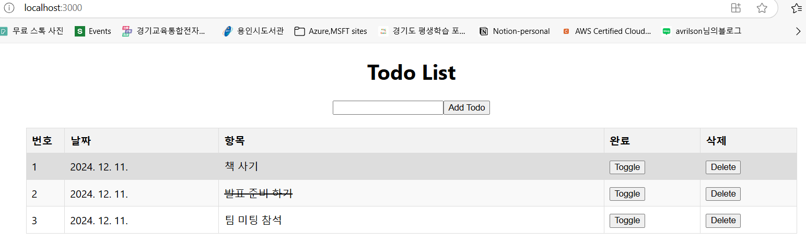

# Project 6: React를 이용한 간단한 웹앱 만들기

### Use case: 
- GitHub Copilot을 사용해 간단한 To-Do 리스트를 만들어 보는 예제입니다.

### 목표:
- 간단한 프론트 앱을 GitHub Copilot을 사용해 만들어 봅니다.

### Steps:
- npx create-react-app mytodo-app

- @workspace 현재 프로젝트구조에 todo 리스트를 만드는 앱을 만드는데 필요한 파일들 제안해 줘
    ```
    mytodo-app/
    ├── src/
    │   ├── components/
    │   │   ├── AddTodo.js
    │   │   ├── TodoApp.js
    │   │   ├── TodoItem.js
    │   │   └── TodoList.js
    │   ├── App.css
    │   ├── App.js
    │   ├── App.test.js
    │   ├── index.css
    │   ├── index.js
    │   ├── reportWebVitals.js
    │   └── setupTests.js
    ```
- 완료된 항목을 라인쓰루로 표시하는 버튼을 추가하도록 제안받아 봅니다.
- 항목을 삭제하는 버튼을 추가하도록 제안받아 봅니다.
- Todo list를 테이블 형태로 저장하도록 제안받아 봅니다.
  - 테이블의 크기 위치 색상등을 조정하는 CSS를 제안받아 봅니다.
  - 기타 원하는 CSS 수정을 제안받아 봅니다.



### 추가 학습:
- 만들어진 React 앱을 Azure Kubernetes Service(AKS)에 배포하는 GitHub Actions 워크플로우를 Copilot에게 제안받아 봅니다.

